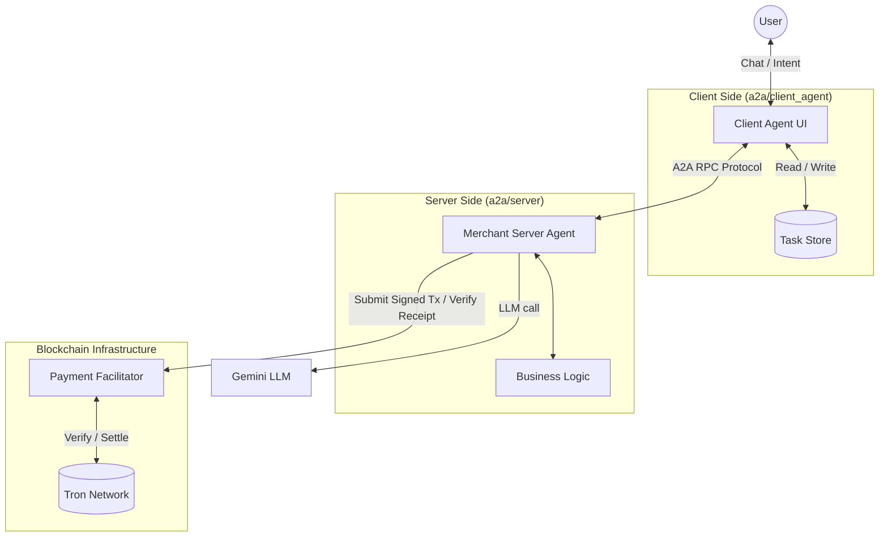
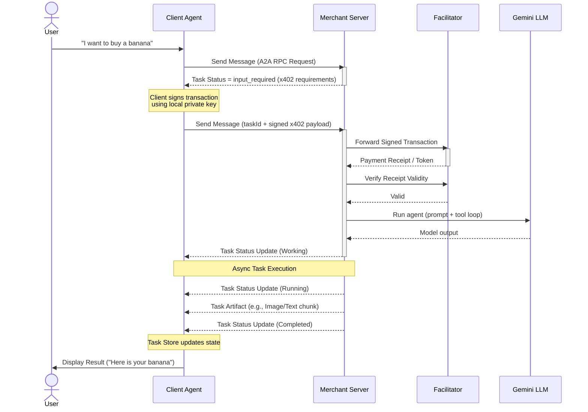

# A2A Demo Architecture & Flow

This document provides a high-level overview of the Agent-to-Agent (A2A) and X402 payment protocol integration.

## What runs where

### Client (`a2a/client_agent`)

- **Entry for ADK Web UI**: `client_agent/__init__.py` exports `root_agent`.
- **Orchestrator**: `client_agent/client.py` implements `ClientAgent`.
- **Remote connection wrapper**: `RemoteAgentConnection` (inside `client.py`) talks to the Merchant Server via the A2A client.
- **Local signing**: `client_agent/wallet.py` (`TronLocalWallet`) signs the X402 payment payload using `TRON_PRIVATE_KEY`.
- **Task state**: `client_agent/task_store.py` stores task + artifact updates so the UI can render progress.

### Server (`a2a/server`)

- **ASGI app**: `server/__main__.py` builds a Starlette app via `A2AStarletteApplication`.
- **Merchant agent**: `server/merchant.py` defines `MerchantAgent` (LLM agent) and raises `x402PaymentRequiredException` to request payment.
- **Execution bridge**: `server/executor.py` (`ADKAgentExecutor`) adapts A2A requests into an ADK `Runner` loop.
- **Payment verification/settlement**: `server/payment.py` (`x402MerchantExecutor`) wraps the executor and calls **Facilitator** for `fee_quote`, `verify`, and `settle`.
- **Message format conversion**: `server/parts.py` converts between A2A `Part` and `google.genai.types.Part`.

## Environment variables (shared `.env` at repo root)

- `GOOGLE_API_KEY` (or `GOOGLE_GENAI_USE_VERTEXAI=TRUE`): required by the **server** because the Merchant Agent calls the LLM.
- `PAY_TO_ADDRESS`: required by the **server** (merchant receiving address).
- `TRON_PRIVATE_KEY`: required by the **client** (to sign payment payload).
- `TRON_NETWORK` (default `tron:nile`)
- `FACILITATOR_URL`

## Conceptual Model

The conceptual model illustrates the main components involved in the A2A interaction.

## Sequence Diagram

The following sequence diagram demonstrates a typical high-level flow when a Client Agent interacts with the Merchant Server, encountering an X402 Payment requirement.

