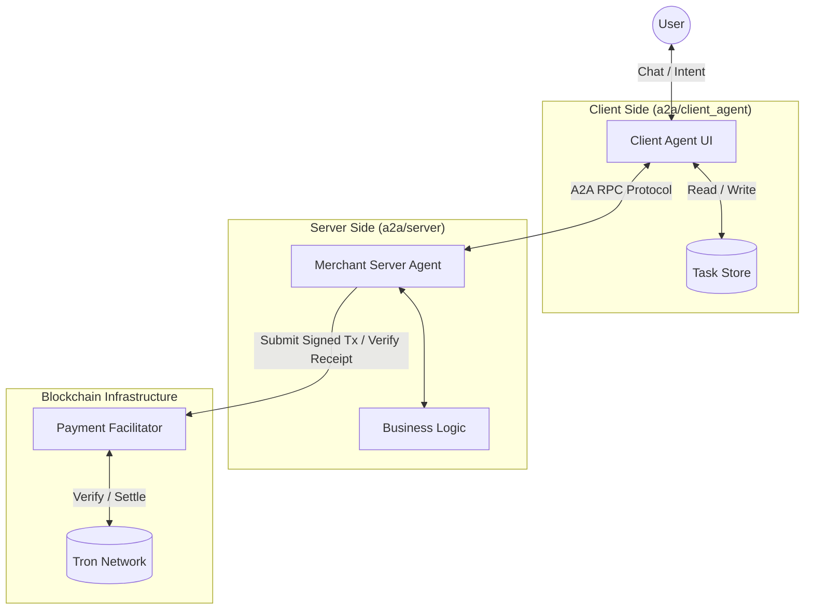
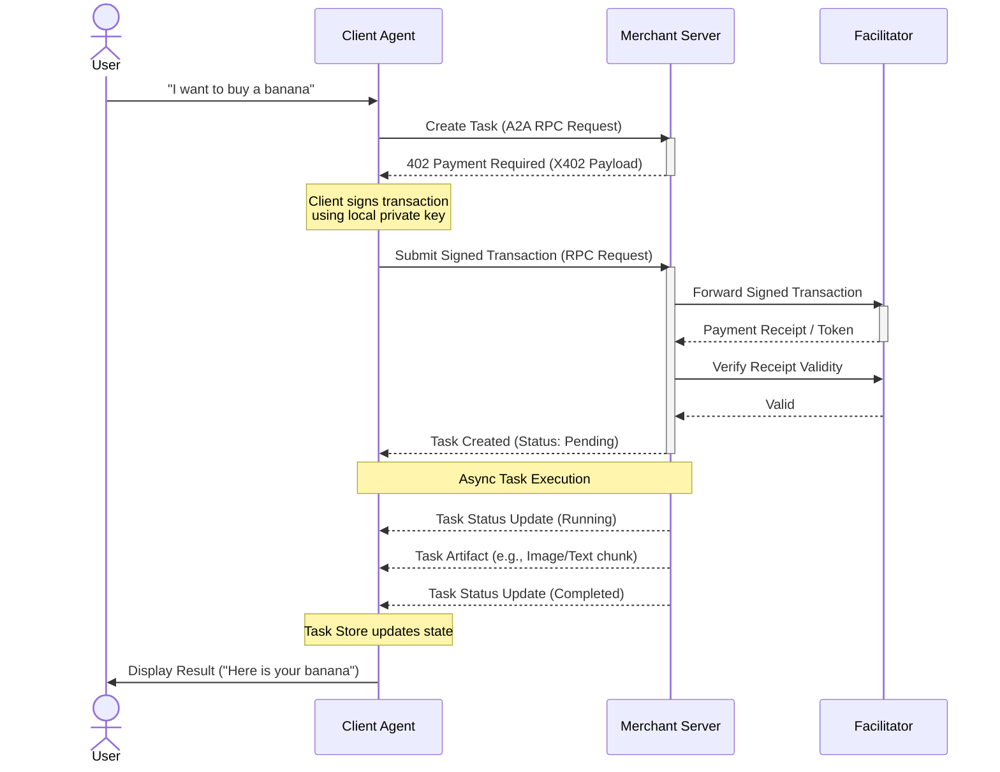

# A2A Demo Architecture & Flow

This document provides a high-level overview of the Agent-to-Agent (A2A) and X402 payment protocol integration.

## Conceptual Model

The conceptual model illustrates the main components involved in the A2A interaction.

## Sequence Diagram

The following sequence diagram demonstrates a typical high-level flow when a Client Agent interacts with the Merchant Server, encountering an X402 Payment requirement.

